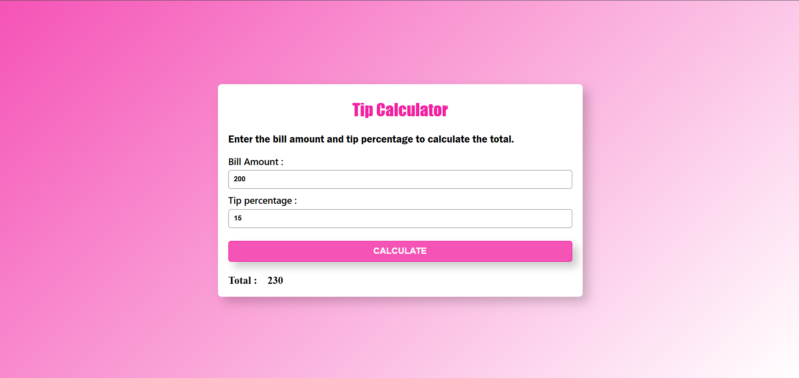

# Tip Calculator

A simple, clean web-based **Tip Calculator** application that allows users to quickly determine the total bill amount including a custom tip percentage.

## Features

- **Bill Amount Input:** Enter the total cost of the bill.
- **Tip Percentage Input:** Enter the desired tip percentage (e.g., 15%).
- **Instant Calculation:** Click the **CALCULATE** button to see the total amount (Bill + Tip).
- **Responsive & Clean UI:** Features a vibrant, modern pink gradient design with a clean card container.

## Screenshot

## How to Run

1. Clone or download this repository.
2. Open the `index.html` file in any modern web browser.
3. Enter the bill amount and tip percentage, then click **CALCULATE**.

## Technologies Used

- HTML5
- CSS3 (Custom Gradients & Shadows)
- JavaScript (DOM manipulation and arithmetic calculations)
